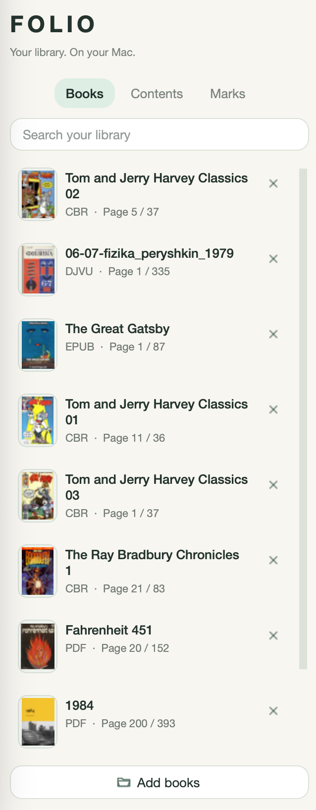
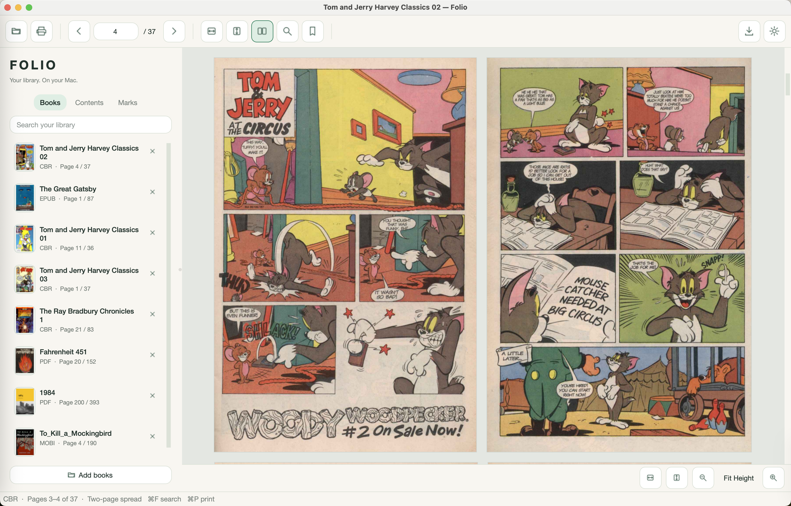
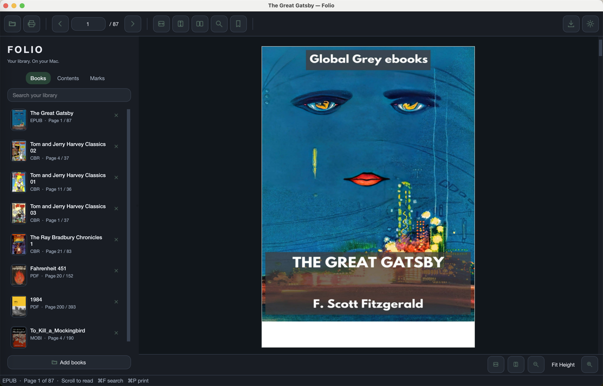
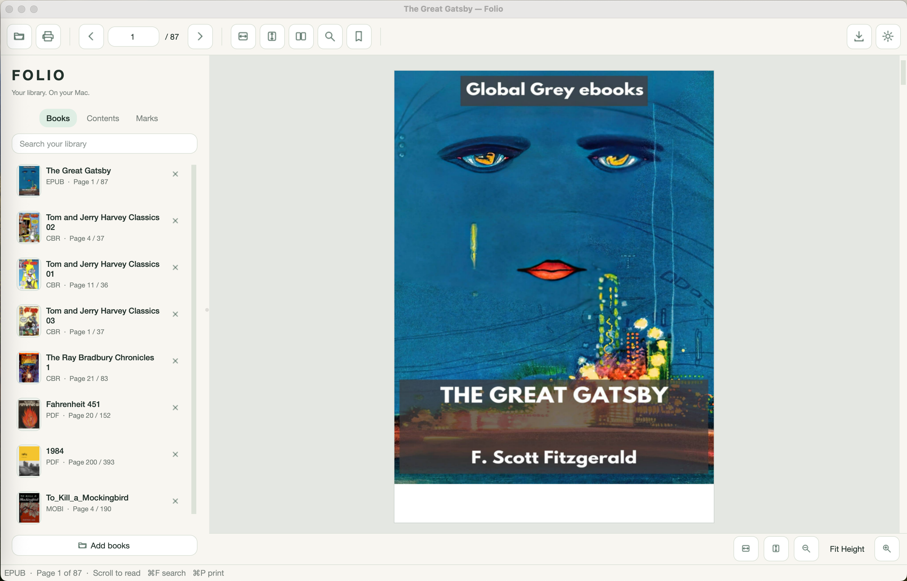
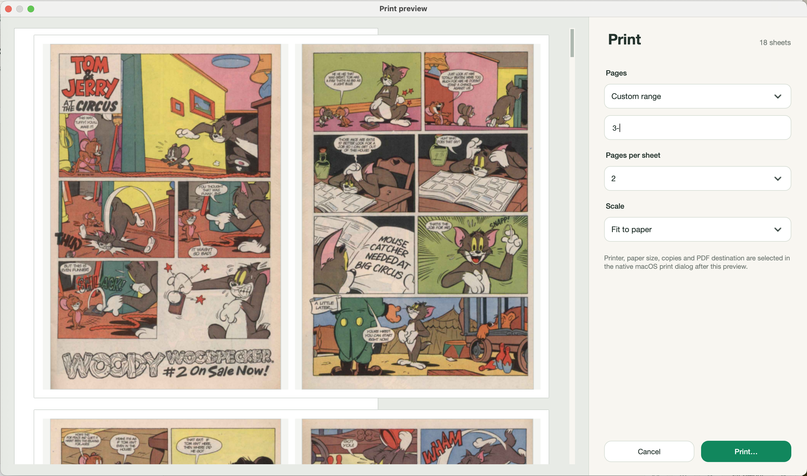

# Folio — macOS Ebook & Document Reader

**Folio is a free, open-source, offline ebook and document reader for macOS Apple Silicon.** Read **PDF, DjVu, EPUB, FB2, MOBI, XPS, CBZ, TXT and images** in one app with continuous vertical scrolling, search, bookmarks, print preview, zoom controls and PDF export.

[](https://github.com/danilfg/folio-macos-ebook-reader/releases/latest)
[](https://github.com/danilfg/folio-macos-ebook-reader/releases/latest)
[](LICENSE)
[](https://github.com/danilfg/folio-macos-ebook-reader/actions/workflows/ci.yml)

## Download Folio for macOS

**Apple Silicon (M1, M2, M3, M4 and newer):**

**[Open the latest Folio release](https://github.com/danilfg/folio-macos-ebook-reader/releases/latest)**

Download the versioned DMG asset, for example:

```text
Folio-0.3.2-macOS-arm64.dmg
```

1. Open the latest GitHub Release.
2. Download `Folio-<version>-macOS-arm64.dmg` under **Assets**.
3. Open the DMG.
4. Drag **Folio.app** to **Applications**.
5. Open Folio and drop a book into the window.

Folio targets **macOS 14 Sonoma or newer**. Release builds bundle the required DjVu command-line tools, so end users do not need Python, Homebrew or `Install.command`.

### If macOS says “Folio Not Opened”

Current Folio builds are not yet notarized with an Apple Developer ID, so macOS Gatekeeper may show:

> “Apple could not verify ‘Folio’ is free of malware that may harm your Mac or compromise your privacy.”

To open Folio:

**Method 1 — System Settings**

1. Try to open **Folio** once and dismiss the warning.
2. Open **System Settings → Privacy & Security**.
3. Scroll to **Security**.
4. Find the message that Folio was blocked.
5. Click **Open Anyway**.
6. Confirm with your Mac password or Touch ID, then click **Open**.

**Method 2 — Finder**

1. Open **Applications** in Finder.
2. Control-click or right-click **Folio**.
3. Choose **Open**.
4. Confirm **Open**.

You normally need to do this only once for that copy of the app. Future releases will support Developer ID signing and Apple notarization.

## Why Folio

Folio is intended for people who want a lightweight **Mac ebook reader**, **DjVu reader**, **PDF reader** and general-purpose offline document viewer without uploading books to a cloud service.

- **Continuous vertical scrolling** with wheel and trackpad.
- **Fast lazy rendering** of visible and nearby pages.
- **PDF, DjVu, EPUB, FB2, MOBI and more** in one local library.
- **Text search** where the source format exposes text.
- **Bookmarks and reading position** stored locally.
- **Print preview** before the native macOS print dialog.
- **Fit width, fit height and percentage zoom controls**.
- **Background PDF export** so the reader stays usable during conversion.
- **Keyboard page navigation** with arrow keys.
- **Private by design** — no account, no telemetry, no cloud upload.

## Supported formats

| Format | Engine | Notes |
|---|---|---|
| PDF | MuPDF / PyMuPDF | Password-protected PDFs supported; document permissions are respected |
| DjVu / DJV | DjVuLibre | Direct page rendering, hidden-text search, optimized one-pass PDF export |
| EPUB | MuPDF | DRM-free EPUB |
| FB2 / FB2.ZIP | MuPDF | One FB2 file per ZIP |
| MOBI / PRC | MuPDF | Legacy Mobipocket support; no DRM |
| XPS / OXPS | MuPDF | Support depends on the document |
| CBZ | MuPDF | ZIP-based comics |
| TXT | Folio + MuPDF | UTF-8, UTF-16 BOM and Windows-1251 |
| PNG/JPEG/TIFF/BMP/GIF/SVG | MuPDF | Static image viewing |

Not supported: DRM, AZW3/KFX, CHM, CBR/RAR, DOC/DOCX and OCR generation.

## DjVu → PDF export

Folio uses **DjVuLibre's native multi-page PDF output in a single pass**, at 160 DPI with quality 80 compression. This avoids encoding every page to PNG first and is designed to be dramatically faster and smaller for large scanned books.

The exported PDF contains rendered page images. Existing hidden DjVu OCR text is not currently copied into the PDF output.

## Screenshots

### Library



### Two-page reading mode



### Dark mode



### Light mode



### Print preview



The source screenshots are stored in [`docs/screenshots/`](docs/screenshots/README.md).


## Keyboard shortcuts

| Shortcut | Action |
|---|---|
| ⌘O | Open books |
| ⌘⇧O | Add a folder |
| ← / ↑ | Previous page |
| → / ↓ | Next page |
| ⌘F | Search in the book |
| ⌘D | Add / remove bookmark |
| ⌘P | Print with preview |
| ⌘⇧S | Export as PDF |
| ⌘+ / ⌘- | Zoom in / out |
| ⌘0 | 100% zoom |
| ⌘B | Show / hide sidebar |
| ⌘⇧F | Full screen |

## Build from source

```bash
brew install python@3.12 djvulibre
python3.12 -m venv .venv
source .venv/bin/activate
pip install -r requirements.txt
python main.py
```

Run tests:

```bash
python -m unittest discover -s tests -v
```

Build a standalone Apple Silicon app and DMG:

```bash
pip install pyinstaller==6.16.0
python build_macos.py --dmg --output dist
```

The local build script currently creates:

```text
dist/Folio.app
dist/Folio-macOS-arm64.dmg
```

The GitHub Release workflow renames the DMG to include the release version before publishing, for example:

```text
Folio-0.3.2-macOS-arm64.dmg
```

## Architecture

- `folio/app.py` — PySide6 desktop UI and reader shell
- `folio/engine.py` — document engine running in a separate process over JSON Lines
- `folio/storage.py` — local SQLite library, reading position and bookmarks
- `build_macos.py` — Apple Silicon `.app` + DMG builder
- `.github/workflows/ci.yml` — automated test suite
- `.github/workflows/release.yml` — macOS release build and publishing

## Privacy

Folio opens local files and stores only library references, reading positions and bookmarks in a local SQLite database. It does not upload books, require an account or contain application telemetry.

Library data on macOS:

```text
~/Library/Application Support/Folio/library.sqlite3
```

## Contributing

Issues and pull requests are welcome. Start with [CONTRIBUTING.md](CONTRIBUTING.md). For security issues, use [SECURITY.md](SECURITY.md) rather than a public issue.

## License

Folio source code is licensed under **GNU AGPL-3.0-or-later**. See [LICENSE](LICENSE) and [THIRD_PARTY.md](THIRD_PARTY.md) for dependency licensing details.
